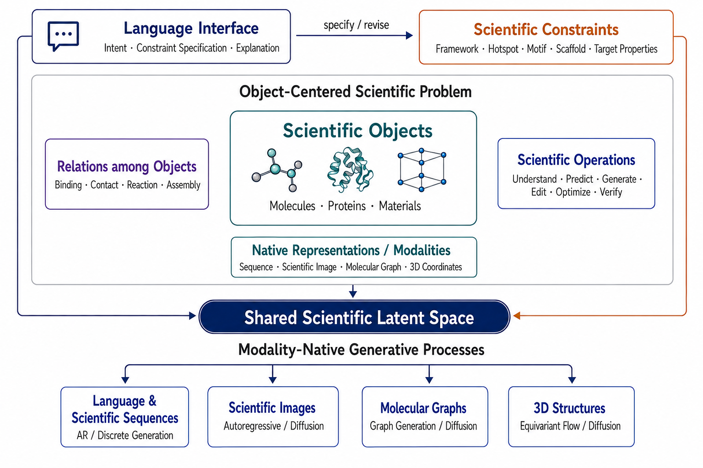

*Some Thoughts on the Next Generation of Scientific Foundation LLMs*

## Why Current Scientific LLM Paradigms Are Not Enough

Scientific LLMs are evolving along three broad paths.

**Scientific chatbots** bring scientific knowledge and reasoning into language models, enabling literature synthesis, technical question answering, and hypothesis generation. Yet molecules, proteins, and materials still enter mainly as serialized strings or rendered images. Language is an effective interface for intent and explanation, but it is not necessarily the right computational or generative space for every scientific object.

**Agentic workbenches and tool-using systems**, such as Claude Science, connect LLMs to databases, code environments, scientific packages, specialist models, and compute.[^1] They are immediately useful, but their scientific capabilities remain distributed across external components. The LLM plans and orchestrates; molecule generation, structure prediction, and simulation still happen elsewhere.

**Unified scientific foundation models** begin to move scientific objects into the modeling stack itself. NatureLM serializes multiple scientific domains within one autoregressive model; LOGOS introduces a shared grammar for heterogeneous objects and discretized interactions; BioMatrix jointly tokenizes molecular and protein sequences, structures, and language; and S1-Omni connects shared task representations to domain-specific result decoders.[^2][^3][^4][^5]

These systems move substantially closer to unified scientific modeling. Nevertheless, several questions remain open: How should scientific objects and relations share a composable latent space? How can language constraints be grounded in native scientific representations? How can new domains and capabilities be added without destabilizing existing ones?

## Defining Next-Generation Scientific Foundation LLMs

I use the term **Next-Generation Scientific Foundation LLM** to mean:

> A language-anchored, natively multimodal generative foundation model that represents heterogeneous scientific objects and their relations in a shared scientific latent space, grounds language-specified constraints in scientific representations, and generates through processes native to each modality.

Here, **language-anchored** means that language serves as the bridge between human intent and scientific objects. Conventional task-specific generators often accept only narrowly predefined conditions, whereas an LLM-based system allows users to express open-ended design intentions—such as removing hydrophobic groups, preserving a molecular scaffold, or editing an antibody around a given framework and set of hotspots. By grounding these intentions as actionable scientific constraints, language makes scientific generation more interactive and controllable, while providing a natural interface for explaining the resulting designs.

The term **LLM** emphasizes this language-centered interface and reasoning backbone; it does not require every scientific modality to be generated autoregressively.

### Scientific Problems Are Object-Centered

A scientific problem can be described as

$$
\mathcal{P} =
(\mathcal{O}, \mathcal{R}, \mathcal{M}, \mathcal{A}; \mathcal{C}),
$$

where $\mathcal{O}$ denotes **Scientific Objects**; $\mathcal{R}$, their **Relations**; $\mathcal{M}$, their **Representations / Modalities**; $\mathcal{A}$, the **Operations** performed on them; and $\mathcal{C}$, the **Constraints** that valid solutions must satisfy.

These elements are not orthogonal. Scientific Objects form the ontological core. Relations connect multiple objects. Representations determine how objects and relations are observed or computed. Operations transform them. Constraints specify what may change, what must remain invariant, and what counts as an acceptable result.

Consider antibody design:

| Problem element              | Antibody design example                                                             |
| ---------------------------- | ----------------------------------------------------------------------------------- |
| Scientific Objects           | Antibody and antigen                                                                |
| Relations                    | Binding and CDR–epitope contacts                                                    |
| Representations / Modalities | Amino-acid sequences and complex 3D structures                                      |
| Operations                   | Conditional CDR generation and optimization                                         |
| Constraints                  | Fixed framework, specified hotspots, editable CDRs, and developability requirements |

A user might request: *keep the framework fixed, redesign the CDRs, and contact these antigen hotspots*. Such requirements cannot remain merely as words in a prompt. **Constraint Grounding** must compile them into sequence masks, geometry anchors, contact constraints, or optimization objectives.

The **Shared Scientific Latent Space** then represents the intent, objects, relations, constraints, and current generation state together. The model can subsequently invoke the appropriate generative process: discrete generation for language and biological sequences, graph-native generation for molecular graphs, diffusion or flow matching for images, and equivariant diffusion or flow matching for 3D structures.

A unified model therefore does not require every output to share one tokenizer, decoder, or generation objective. What should be shared is the model’s understanding of scientific objects, relations, constraints, and task states. The generation process should preserve the structure and inductive biases of each output space.

In this sense, Next-Generation Scientific Foundation LLMs are **language-anchored, object-centered, constraint-grounded, and modality-native**.

## A Four-Part Research Agenda

### 1. Native Scientific Generation

Many unified scientific models gain scalability by converting heterogeneous objects into discrete sequences and reducing every task to next-token prediction. The alternative is not to force autoregressive generation, diffusion, and flow matching into one algorithm. It is to let a shared backbone provide a common scientific condition to different modality-native generators.

Transfusion offers an early precedent: one Transformer can jointly support autoregressive text generation and diffusion-based image generation while retaining different objectives.[^6] Extending this idea to scientific models requires native support for sequences, graphs, images, and continuous 3D geometry with appropriate equivariance.[^7][^8]

> How can a shared backbone condition modality-native autoregressive, diffusion, and flow-based generators across sequences, graphs, images, and continuous 3D geometry without erasing their distinct inductive biases?

### 2. Scalable Scientific Specialization

A Scientific Foundation LLM cannot be trained once and considered complete. It must continually acquire new domains, modalities, and capabilities while preserving its language interface, general reasoning, and previously learned scientific knowledge.

Continued pretraining provides one path, while modular architectures such as Mixture of Experts, Mixture of Transformers, and routed LoRA specialists offer more explicit control over capacity allocation.[^9][^10][^11]
> How can scientific capabilities be added continuously and at scale without catastrophic forgetting or cross-domain interference?

### 3. Scientific Latent Reasoning

The long-term goal is not merely to describe scientific objects, but to solve open-ended design problems—such as developing new medicines—that require high-level reasoning over structures, interactions, constraints, and uncertainty.

A useful way to frame the evolution of LLM reasoning is in three stages: explicit Chain-of-Thought for text-centric tasks; **thinking with images**, where multimodal models inspect rendered scientific objects and consult external tools; and **latent thinking**, where reasoning occurs directly over learned scientific representations.

The second stage is already useful. A model can inspect a binding pose in PyMOL, identify visible structural issues, and revise a proposal. Yet it is unlikely to be the endpoint of scientific intelligence. Many scientific states cannot be fully captured by human-readable renderings: a molecular graph or rendered 3D complex is only a partial projection of a much richer state. Evaluation is also intrinsically weak—computational oracles are approximate, while wet-lab feedback is expensive and low-throughput. External tools should therefore remain part of the feedback loop, but not become the sole substrate or oracle of reasoning.

**Scientific Latent Reasoning** instead asks the model to reason directly over latent representations of scientific objects, relations, geometry, constraints, and uncertainty. Language remains the interface through which humans specify intent and understand the result. By analogy, the Bitter Lesson suggests that representations and heuristics designed primarily for human inspection should not necessarily define the ceiling of machine reasoning: scalable learning and search may discover strategies that are useful precisely because they are not intuitive to us.[^12]

> How can a model learn high-level scientific reasoning directly in latent space, under imperfect computational oracles and sparse experimental feedback, while remaining controllable through language?

### 4. Scalable Multimodal Infrastructure

The infrastructure must jointly support variable-length sequences, graphs, images, and 3D coordinates; coordinate autoregressive, diffusion, and flow-matching objectives; manage gradients between shared and modality-specific modules; and scale sparse routing across distributed hardware.

It must also make the system extensible. Adding a new scientific domain or modality should resemble registering a new data stream, objective, and generator.

> What training infrastructure can jointly schedule heterogeneous data, generation objectives, and model modules while remaining efficient, scalable, and extensible?

These four directions describe how such a system might be built. A deeper question is what objective should ultimately guide it.

## From Oracles to Intent

From a Sutton-style reinforcement-learning perspective, a Scientific Foundation LLM can be viewed as an agent: it observes a scientific state, takes actions, receives feedback, and iteratively pursues a goal.[^13] But this goal cannot be reduced to a single oracle score. Biomolecular design spaces are open-ended and combinatorial, while every oracle is fitted to a sparse and biased subset of what has already been observed. A validated molecule may complete one campaign, but it cannot by itself define the general objective of a foundation agent.

At the level of a general scientific agent, the deeper goal specification is **scientifically grounded human intent**. Intent specifies what should be created, preserved, removed, or traded off—from affinity and selectivity to scaffold preservation, hydrophobic-group removal, or hotspot engagement. Oracles, simulations, and experiments are not the goal itself; they are partial feedback through which intent is tested and revised.

The history of medicine reflects this distinction. Tu Youyou reinterpreted inconsistent screening results through an ancient preparation method, redesigned the extraction process, and isolated artemisinin.[^14] Fleming’s contaminated culture plate was accidental, but recognizing its antibacterial significance—and Florey and Chain later turning that clue into a therapy—made penicillin a medicine.[^15][^16] Observation revealed possibilities; human judgment and intent determined which possibilities were pursued.

This perspective also clarifies existing limitations. Specialized models act directly on scientific objects but accept narrow goals; scientific chatbots express intent but rarely act natively on those objects; agentic workbenches connect intent to action, but primarily through external tools.

A next-generation Scientific Foundation LLM should close this loop: language specifies intent, Constraint Grounding makes it actionable, the Shared Scientific Latent Space maintains the evolving state, and modality-native generators act directly on scientific objects. Tools and experiments then provide feedback for the next decision.

This is why I am optimistic about LLMs for science: their deepest value may be to provide a scalable interface through which human intent can directly guide the iterative generation and refinement of scientific objects.

[^1]: Anthropic. *Claude Science, an AI Workbench for Scientists, Is Now Available*. 2026. [Official announcement](https://www.anthropic.com/news/claude-science-ai-workbench)

[^2]: NatureLM Team. *Nature Language Model: Deciphering the Language of Nature for Scientific Discovery*. arXiv:2502.07527, 2025. [Paper](https://arxiv.org/abs/2502.07527) · [Project](https://naturelm.github.io/)

[^3]: Mingyang Li et al. *Speaking the Language of Science: Toward a General-Purpose Generative Foundation Model for the Natural Sciences*. arXiv:2606.16905, 2026. [Paper](https://arxiv.org/abs/2606.16905)

[^4]: Qizhi Pei et al. *BioMatrix: Towards a Comprehensive Biological Foundation Model Spanning the Modality Matrix of Sequences, Structures, and Language*. arXiv:2606.22138, 2026. [Paper](https://arxiv.org/abs/2606.22138) · [Code](https://github.com/QizhiPei/BioMatrix)

[^5]: Jiahao Zhao et al. *S1-Omni: A Unified Multimodal Reasoning Model for Scientific Understanding, Prediction, and Generation*. arXiv:2607.15686, 2026. [Paper](https://arxiv.org/abs/2607.15686) · [Project](https://scienceone-ai.github.io/S1-Omni/)

[^6]: Chunting Zhou et al. *Transfusion: Predict the Next Token and Diffuse Images with One Multi-Modal Model*. arXiv:2408.11039, 2024. [Paper](https://arxiv.org/abs/2408.11039)

[^7]: Yaron Lipman et al. *Flow Matching for Generative Modeling*. ICLR, 2023. [Paper](https://openreview.net/forum?id=PqvMRDCJT9t)

[^8]: Emiel Hoogeboom et al. *Equivariant Diffusion for Molecule Generation in 3D*. ICML, 2022. [Paper](https://proceedings.mlr.press/v162/hoogeboom22a.html)

[^9]: William Fedus et al. *Switch Transformers: Scaling to Trillion Parameter Models with Simple and Efficient Sparsity*. JMLR, 2022. [Paper](https://www.jmlr.org/papers/v23/21-0998.html)

[^10]: Weixin Liang et al. *Mixture-of-Transformers: A Sparse and Scalable Architecture for Multi-Modal Foundation Models*. 2024. [Paper](https://arxiv.org/abs/2411.04996)

[^11]: Xun Wu et al. *Mixture of LoRA Experts*. 2024. [Paper](https://arxiv.org/abs/2404.13628)

[^12]: Rich Sutton. *The Bitter Lesson*. 2019. [Essay](https://www.incompleteideas.net/IncIdeas/BitterLesson.html)

[^13]: Richard S. Sutton and Andrew G. Barto. *Reinforcement Learning: An Introduction*. 2nd edition, MIT Press, 2018. [Book](https://reinforcementlearning.pubpub.org/)

[^14]: Tu Youyou. *Biographical*. NobelPrize.org, 2015. [Article](https://www.nobelprize.org/prizes/medicine/2015/tu/biographical/)

[^15]: Alexander Fleming. *Nobel Banquet Speech*. NobelPrize.org, 1945. [Speech](https://www.nobelprize.org/prizes/medicine/1945/fleming/speech/)

[^16]: NobelPrize.org. *Sir Howard Florey—Facts*. [Article](https://www.nobelprize.org/prizes/medicine/1945/florey/facts/)
